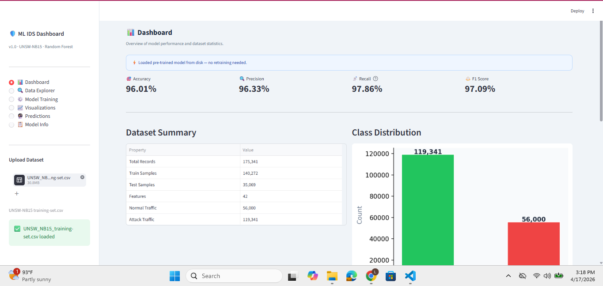
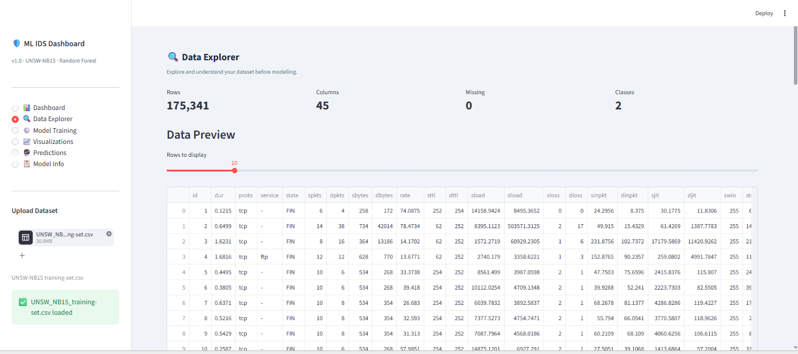
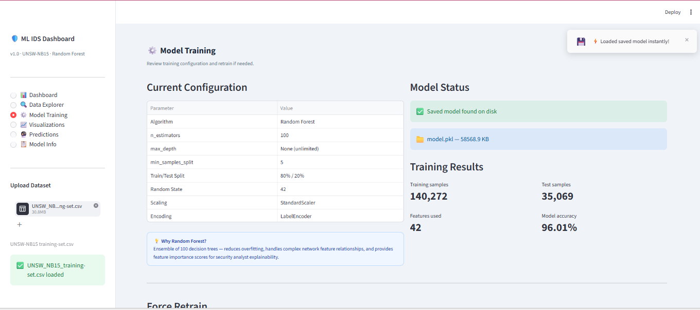
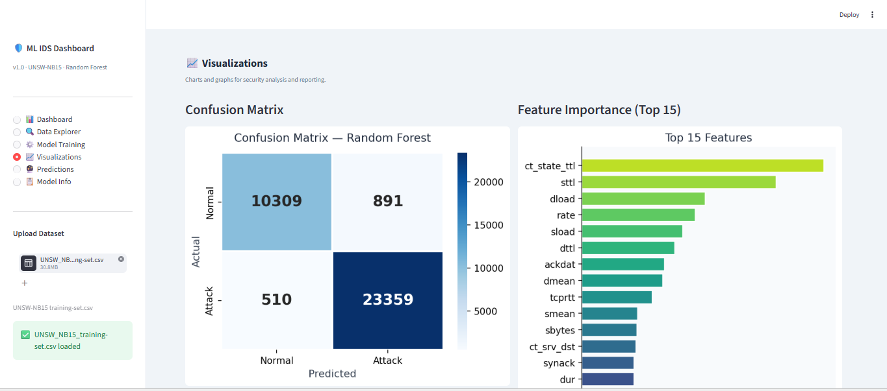
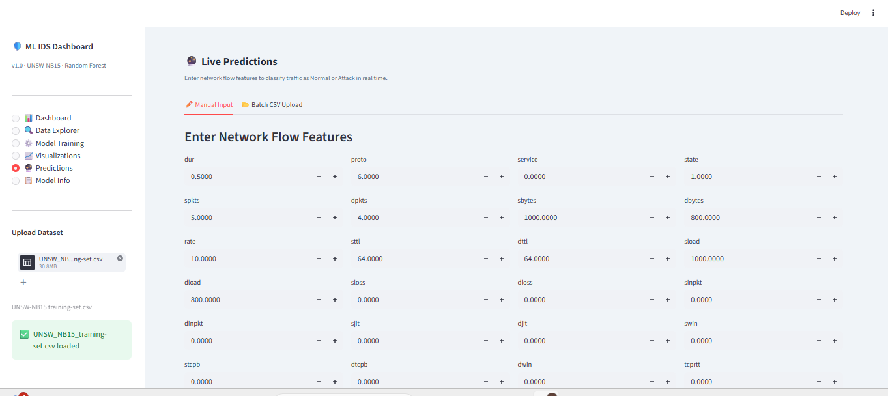
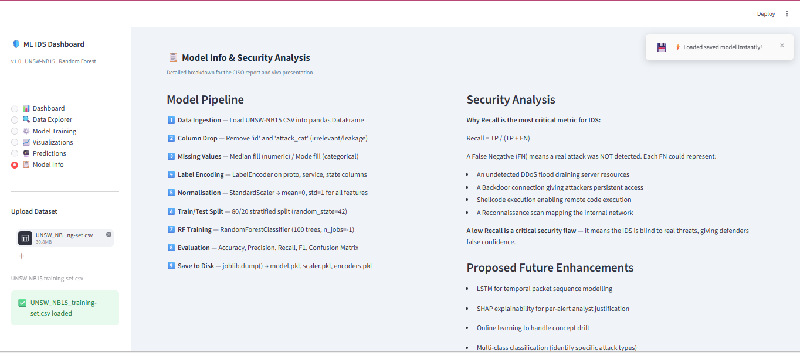

# CLO4 – AI-Powered Intrusion Detection System (IDS) Using Machine Learning

   

## Project Title
**AI-Powered Network Intrusion Detection System — Proof of Concept**

## Objective
Design, develop, and evaluate a Machine Learning model that classifies network traffic as **Normal** or **Attack** to augment the existing NIDS at SecureNet Corp. This project satisfies **CLO 4** of the Information Security course.

---

## Dataset

**UNSW-NB15** — Created by the Australian Centre for Cyber Security (ACCS).

### Download Instructions
1. Visit: https://research.unsw.edu.au/projects/unsw-nb15-dataset
2. Download: `UNSW_NB15_training-set.csv`
3. Place it in the **same directory** as `app.py` and the notebook.

The dataset contains **175,341 records** with **45 features** representing real network traffic including 9 attack categories: Fuzzers, Backdoor, DoS, Exploits, Generic, Reconnaissance, Shellcode, Worms, and Analysis.

---

## How to Run

### Option A — Streamlit Web Dashboard (Recommended)

```bash
pip install -r requirements.txt
python -m streamlit run app.py
```

Open http://localhost:8501. Upload `UNSW_NB15_training-set.csv` from the sidebar on first run. The model trains once (~30–60 seconds) and saves to disk automatically. All future runs load instantly — no re-upload needed.

### Option B — Jupyter Notebook

```bash
pip install pandas numpy scikit-learn matplotlib seaborn jupyter
jupyter notebook CLO4-IDS-ML-Solution.ipynb
```

---

## Streamlit Dashboard — UI Overview

A fully interactive web dashboard providing end-to-end ML pipeline: data upload, model training, visualizations, and live predictions.

**Key feature:** Hybrid persistence — trains once, saves `model.pkl` to disk, loads instantly on all future runs.

---

### Dashboard
Key metrics (Accuracy, Precision, Recall, F1), dataset summary, and class distribution.



---

### Data Explorer
Scrollable raw data preview, stats (175,341 rows, 45 columns, 0 missing values, 2 classes).



---

### Model Training
Full configuration table, model file status (model.pkl — 58,568 KB), training results, and Force Retrain option.



---

### Visualizations
Confusion Matrix (TP: 23,359 | FN: 510 | FP: 891 | TN: 10,309) and Top 15 Feature Importances side by side.



Top 10 Feature Importances with exact Gini scores (ct_state_ttl: 0.1306, sttl: 0.1048, dload: 0.0666).


---

### Live Predictions
Manual input mode (enter network flow features, get instant Normal/Attack result) and Batch CSV upload mode.



---

### Model Info & Security Analysis
9-step pipeline documentation, security analysis of False Negative implications, and proposed future enhancements.



---

## Actual Results

| Metric | Value |
|--------|-------|
| Accuracy | 96.01% |
| Precision | 96.33% |
| Recall (Attack) | 97.86% |
| F1 Score | 97.09% |
| True Positives | 23,359 |
| False Negatives | 510 |
| True Negatives | 10,309 |
| False Positives | 891 |

**Key Security Finding:** 97.86% recall — only 510 out of 23,869 real attacks were missed. High recall is the most critical IDS metric as False Negatives represent undetected breaches.

---

## Project Pipeline

```
Raw UNSW-NB15 Data
       ↓
  Data Cleaning (missing values, type handling)
       ↓
  Encoding (LabelEncoder) + Normalization (StandardScaler)
       ↓
  Train/Test Split (80/20 stratified)
       ↓
  Random Forest Classifier (100 estimators, n_jobs=-1)
       ↓
  Evaluation: Accuracy, Precision, Recall, F1, Confusion Matrix
       ↓
  Feature Importance + Security Analysis
       ↓
  Save model.pkl, scaler.pkl, encoders.pkl to disk
```

---

## Files in This Repository

| File | Description |
|------|-------------|
| `app.py` | Streamlit web dashboard — full interactive pipeline |
| `CLO4-IDS-ML-Solution.ipynb` | Jupyter Notebook — full ML pipeline |
| `requirements.txt` | Python dependencies |
| `README.md` | This file |
| `ui_dashboard.png` | Screenshot: Dashboard page |
| `ui_data_explorer.png` | Screenshot: Data Explorer page |
| `ui_model_training.png` | Screenshot: Model Training page |
| `ui_visualizations.png` | Screenshot: Visualizations page |
| `ui_feature_importance.png` | Screenshot: Feature Importance chart |
| `ui_predictions.png` | Screenshot: Live Predictions page |
| `ui_model_info.png` | Screenshot: Model Info page |
| `plot_class_distribution.png` | EDA: class balance chart |
| `plot_correlation_heatmap.png` | EDA: feature correlation heatmap |
| `plot_confusion_matrix.png` | Confusion matrix plot |
| `plot_feature_importance.png` | Top 15 features plot |

---

## Algorithm Justification

**Random Forest** was selected because:
- Ensemble of 100 decision trees — reduces overfitting vs. a single Decision Tree
- Handles complex, high-dimensional network feature spaces effectively
- Provides built-in Gini feature importance for security analyst explainability
- Robust to noisy data and outliers common in network packet captures
- No assumption about feature distributions — works with mixed data types

**Top features:** `ct_state_ttl` (0.1306), `sttl` (0.1048), `dload` (0.0666), `rate` (0.0611), `sload` (0.0545)

---

## Course Information
- **Course:** Information Security
- **CLO:** 4 — Create solutions to real-life scenarios using security-related tools
- **Assignment:** Assignment 1 — AI-Powered Intrusion Detection Solution

---

## References
- Moustafa, N., & Slay, J. (2015). UNSW-NB15 dataset. https://research.unsw.edu.au/projects/unsw-nb15-dataset
- Streamlit Inc. (2024). https://streamlit.io
- Scikit-learn. https://scikit-learn.org
